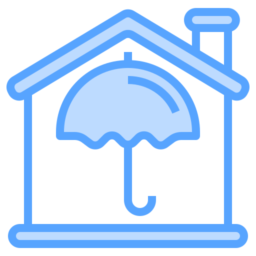

<!-- PROJECT SHIELDS -->
<!--[![Contributors][contributors-shield]][contributors-url]
[![Forks][forks-shield]][forks-url]
[![Stargazers][stars-shield]][stars-url]
[![Issues][issues-shield]][issues-url]
[![MIT License][license-shield]][license-url]
[![LinkedIn][linkedin-shield]][linkedin-url]-->

<!-- PROJECT LOGO -->
 

  

<h3 align="center">HomeGuard</h3>

  

    Smart flooding/leak detector and home environment monitoring system 
     
    <a href="https://github.com/aintic/HomeGuard"><strong>Explore the docs »</strong></a>
     
     
    <a href="https://youtu.be/HxDcWSPe0mw?si=nlwH7xezUtNWPvM4">View Demo</a>
    ·
    <a href="https://github.com/aintic/HomeGuard/issues">Report Bug</a>
    ·
    <a href="https://github.com/aintic/HomeGuard/issues">Request Feature</a>
  

<!-- TABLE OF CONTENTS -->

  
Table of Contents

  <ol>
    <li>
      <a href="#about-the-project">About The Project</a>
      <ul>
        <li><a href="#system-design">System Design</a></li>
        <li><a href="#built-with">Built With</a></li>
      </ul>
    </li>
    <li>
      <a href="#getting-started">Getting Started</a>
      <ul>
        <li><a href="#prerequisites">Prerequisites</a></li>
        <li><a href="#installation">Installation</a></li>
      </ul>
    </li>
    <li><a href="#usage">Usage</a></li>
    <li><a href="#roadmap">Roadmap</a></li>
    <li><a href="#contributing">Contributing</a></li>
    <li><a href="#license">License</a></li>
    <li><a href="#contact">Contact</a></li>
    <li><a href="#acknowledgments">Acknowledgments</a></li>
  </ol>

<!-- ABOUT THE PROJECT -->
## About The Project

A smart flooding and water leak detection system with 2 components: an embedded device and an Android companion app.

The embedded device features:
* Flooding and water leak detection
* Temperature and humidity data collection
* SMS alerts when a flood/leak is detected
* SMS alerts when a flood/leak is cleared
* Wifi Manager provides a web portal for the device's WiFi configuration
* Status LEDs (red - flood/leak event, green - normal)
* Alarm buzzer alerting users within proximity

The Android companion app features:
* Real-time temperature/humidity data
* Real-time graphs of temperature/humidity data
* Real-time water level and flood/leak status
* Option to switch between Celsius/Fahrenheit mode
* Option to mute/unmute device's buzzer

(<a href="#readme-top">back to top</a>)

### System Design

![System Design Diagram][system-diagram]

(<a href="#readme-top">back to top</a>)

### Android App Screenshots

See [resources folder](https://github.com/aintic/HomeGuard/tree/main/resources/screenshots) for screenshots of the Android app.

(<a href="#readme-top">back to top</a>)

### Built With

* [![C++][CPP]][CPP-url]
* [![Kotlin][Kotlin]][Kotlin-url]

(<a href="#readme-top">back to top</a>)

<!-- GETTING STARTED -->
## Getting Started

To get a local copy up and running follow these simple example steps.

### Prerequisites

### Installation

(<a href="#readme-top">back to top</a>)

<!-- USAGE EXAMPLES -->
## Usage

(<a href="#readme-top">back to top</a>)

<!-- ROADMAP -->
## Roadmap

See the [open issues](https://github.com/aintic/HomeGuard/issues) for a full list of proposed features (and known issues).

(<a href="#readme-top">back to top</a>)

<!-- CONTRIBUTING -->
## Contributing

Contributions are what make the open source community such an amazing place to learn, inspire, and create. Any contributions you make are **greatly appreciated**.

If you have a suggestion that would make this better, please fork the repo and create a pull request. You can also simply open an issue with the tag "enhancement".
Don't forget to give the project a star! Thanks again!

1. Fork the Project
2. Create your Feature Branch (`git checkout -b feature/AmazingFeature`)
3. Commit your Changes (`git commit -m 'Add some AmazingFeature'`)
4. Push to the Branch (`git push origin feature/AmazingFeature`)
5. Open a Pull Request

(<a href="#readme-top">back to top</a>)

<!-- LICENSE -->
## License

Distributed under the MIT License. See `LICENSE.txt` for more information.

(<a href="#readme-top">back to top</a>)

<!-- CONTACT -->
## Contact

Alice Nguyen - [LinkedIn](https://www.linkedin.com/in/alice-hna-nguyen)

Project Link: [https://github.com/aintic/HomeGuard](https://github.com/aintic/HomeGuard)

(<a href="#readme-top">back to top</a>)

<!-- ACKNOWLEDGMENTS -->
## Acknowledgments

* [Icon for Logo](https://www.flaticon.com/free-icon/home-security_3108384)
* [README Template](https://github.com/othneildrew/Best-README-Template)
* [Vectorizer AI Tool](https://vectorizer.ai/)

(<a href="#readme-top">back to top</a>)

<!-- MARKDOWN LINKS & IMAGES -->
<!-- https://www.markdownguide.org/basic-syntax/#reference-style-links -->
[contributors-shield]: https://img.shields.io/github/contributors/aintic/HomeGuard.svg?style=for-the-badge
[contributors-url]: https://github.com/aintic/HomeGuard/graphs/contributors
[forks-shield]: https://img.shields.io/github/forks/aintic/HomeGuard.svg?style=for-the-badge
[forks-url]: https://github.com/aintic/HomeGuard/network/members
[stars-shield]: https://img.shields.io/github/stars/aintic/HomeGuard.svg?style=for-the-badge
[stars-url]: https://github.com/aintic/HomeGuard/stargazers
[issues-shield]: https://img.shields.io/github/issues/aintic/HomeGuard.svg?style=for-the-badge
[issues-url]: https://github.com/aintic/HomeGuard/issues
[license-shield]: https://img.shields.io/github/license/aintic/HomeGuard.svg?style=for-the-badge
[license-url]: https://github.com/aintic/HomeGuard/blob/main/LICENSE.txt
[linkedin-shield]: https://img.shields.io/badge/-LinkedIn-black.svg?style=for-the-badge&logo=linkedin&colorB=555
[linkedin-url]: https://linkedin.com/in/alice-hna-nguyen
[system-diagram]: resources/HomeGuard_BlockDiagram.png
[CPP]: https://img.shields.io/badge/C++-000000?style=for-the-badge&logo=Cplusplus&logoColor=white
[CPP-url]: https://isocpp.org/
[Kotlin]: https://img.shields.io/badge/Kotlin-563D7C?style=for-the-badge&logo=Kotlin&logoColor=white
[Kotlin-url]: https://kotlinlang.org/
 
